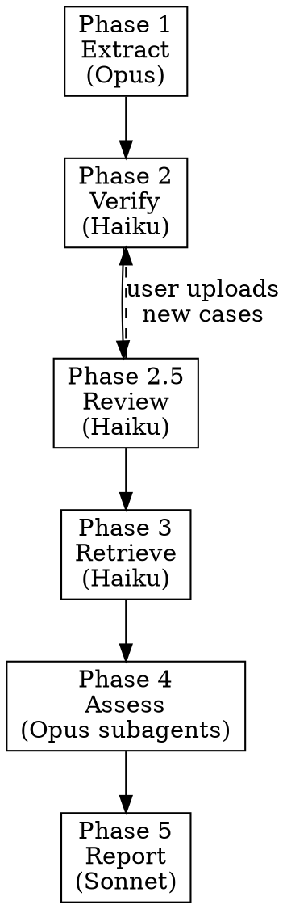

# /verify-brief — Legal Brief Citation Verifier

Guides a multi-phase workflow to extract every citation from a legal brief, verify each case via CourtListener, retrieve opinion texts, and assess whether each citation actually supports the proposition it's cited for.

**Requirements:** `citation_verifier` package installed, `COURTLISTENER_API_TOKEN` in environment or `.env`.

## Startup Checks

Before anything else:

1. Run `python -m citation_verifier --help` — if it fails, tell user to install: `pip install -e /path/to/citation-verifier`
2. Check for API token: `grep COURTLISTENER_API_TOKEN .env 2>/dev/null || echo $COURTLISTENER_API_TOKEN` — if missing, guide user to https://www.courtlistener.com/ > Profile > API Keys

## Working Directory

Create `briefs/<brief-name>/` in the current working directory:

```
briefs/<brief-name>/
├── brief.txt              # Extracted/original brief text
├── claims.csv             # Master table
├── verification.json      # Raw verification results
├── opinions/              # Downloaded opinion texts
└── report.html            # Optional HTML report
```

Ask the user for a short name for the brief if not obvious from the filename.

## Model Recommendations

| Phase | Model | Rationale |
|-------|-------|-----------|
| 1 (Extract) | Opus | Deep legal comprehension for proposition extraction |
| 2 (Verify) | Haiku | Mechanical: run verifier, parse results, update CSV |
| 2.5 (Review) | Haiku | Present results, collect user input |
| 3 (Retrieve) | Haiku | Mechanical: API calls, save files |
| 4 (Assess) | Opus (subagents) | Deep comprehension of opinion text |
| 5 (Report) | Sonnet | Formatting and summarization |

## AskUserQuestion Rules

**Follow these rules every time you use AskUserQuestion in any phase:**

1. **One question per call.** Never batch multiple questions into one AskUserQuestion.
2. **AskUserQuestion must be the ONLY tool call in your response.** Do not call it alongside other tools.
3. **If AskUserQuestion returns without clear answer text** (empty string, ".", or "User has answered your questions: ." with no actual selection), do NOT assume defaults. Re-ask the question with simpler phrasing.

## Phases

Run phases sequentially. The user can stop after any phase and resume later — `claims.csv` is the checkpoint.



### Phase 1: Extract Claims + Citations

1. Read the brief (PDF via Read tool, or user pastes text)
2. Work through page by page, extracting every **proposition-case pair**:
   - Each distinct legal claim + its supporting case = one row
   - Same case cited for different propositions = separate rows
   - Same proposition supported by multiple cases = separate rows
3. Write `claims.csv` with these columns:

| Column | Phase filled | Description |
|--------|-------------|-------------|
| `page` | 1 | Page number in brief |
| `proposition` | 1 | Legal claim/proposition/quote as stated. Use quotation marks for direct quotes. |
| `cited_case` | 1 | Full citation from brief (name, reporter, pinpoint) |
| `retrieved_case` | 2 | Matched case name + date + status |
| `supporting_language` | 4 | Passage(s) from opinion. Numbered if multiple: (1) Supports: "..." (2) Contradicts: "..." |
| `assessment` | 4 | Green / Yellow / Red with rationale |
| `cl_url` | 2 | CourtListener URL (internal) |
| `cl_status` | 2 | Raw verification status (internal) |
| `diagnostics` | 2 | Verification diagnostics (internal) |
| `user_action` | 2.5 | User override: accepted/rejected/uploaded/fake/inapplicable (internal) |
| `opinion_file` | 3 | Path to opinion text file (internal) |

4. Report: "Found X propositions citing Y unique cases across Z pages"

### Phase 2: Verify Citations

**Use the Python API directly** — do NOT shell out to the CLI.

1. Extract unique cases from `cited_case` column
2. Write and run a Python script via Bash:

```python
import json
from citation_verifier import CitationVerifier
from dataclasses import asdict

verifier = CitationVerifier()
citations = [
    # ... unique citations extracted from claims.csv
]

results = {}
for i, cite in enumerate(citations, 1):
    print(f"  Verifying {i}/{len(citations)}: {cite[:60]}...", flush=True)
    result = verifier.verify(cite)
    d = asdict(result)
    d["status"] = result.status.value
    results[cite] = d

with open("WORKDIR/verification.json", "w") as f:
    json.dump(results, f, indent=2)

print(json.dumps({"count": len(results)}, indent=2))
```

Replace `WORKDIR` with the actual brief working directory path.

3. Parse results, update `claims.csv` with verification results

**Status mapping** (matches web app Retrieve page):

| VerificationStatus | Display | Meaning |
|---|---|---|
| VERIFIED, LIKELY_REAL | **Ready** | Case found and confirmed |
| POSSIBLE_MATCH + name diagnostic | **Check Name** | Found but name differs |
| POSSIBLE_MATCH + court diagnostic | **Check Court** | Found but court differs |
| POSSIBLE_MATCH + date diagnostic | **Check Date** | Found but date differs |
| POSSIBLE_MATCH (no specific diagnostic) | **Review** | Needs manual review |
| NOT_FOUND | **Not Found** | Could not locate |

Parse diagnostics for "Check" labels: match on `name (mismatch|differs)`, `court mismatch`, `date mismatch` (case-insensitive). Multiple flags can appear together.

4. Save raw JSON to `verification.json`
5. Report: "X Ready, Y need review, Z not found"

### Phase 2.5: Interactive Review

Present verification results and let user take action.

**For each "Check" case** (one at a time), use AskUserQuestion:
- Show: cited case, matched case name, URL, what's different
- Options: **Accept** (`user_action=accepted`) or **Reject** (`user_action=rejected`)

**For each "Not Found" case** (one at a time), use AskUserQuestion:
- Options:
  - **Upload a case** — user provides file path or pastes text, saved to `opinions/` (`user_action=uploaded`)
  - **Mark as fake** — confirmed hallucinated (`user_action=fake`, assessment=Red, supporting_language="Case confirmed fictitious -- citation does not exist.")
  - **Mark as inapplicable** — wrong case entirely (`user_action=inapplicable`, assessment=Red, supporting_language="Citation inapplicable -- removed by reviewer.")
  - **Skip** — leave as Not Found, assess as Red later

Update `claims.csv` after each decision (incremental saves).

### Phase 3: Retrieve Opinion Texts

Download opinion texts for all cases with status Ready or `user_action=accepted`. Skip cases marked fake/inapplicable. User-uploaded texts are already in `opinions/`.

**Parallelism:** Sequential. The CourtListener API has a 1-second rate limit, so parallelism is counterproductive for downloads.

**Preferred approach (async, ~2x faster for 5+ cases):**

```python
import asyncio, json, re, os
from citation_verifier.client import AsyncCourtListenerClient

cases = [
    # {"cite": "...", "url": "https://www.courtlistener.com/opinion/...", "slug": "case-name-slug"}
]
output_dir = "WORKDIR/opinions"
os.makedirs(output_dir, exist_ok=True)

async def download_all():
    async with AsyncCourtListenerClient() as client:
        for i, case in enumerate(cases, 1):
            print(f"  Downloading {i}/{len(cases)}: {case['slug']}...", flush=True)
            result = await client.get_opinion_text_with_metadata(case["url"])
            if not result or not result.get("text"):
                print(f"    No text available for {case['slug']}")
                continue

            # Build header (borrowed from web app download_texts format)
            lines = [result.get("case_name", case["slug"])]
            citations = result.get("citations", [])
            if citations:
                lines.append(", ".join(citations))
            if result.get("court"):
                lines.append(result["court"])
            if result.get("date_filed"):
                lines.append(f"Filed: {result['date_filed']}")
            if result.get("docket_number"):
                lines.append(f"Docket No. {result['docket_number']}")
            lines.append(f"Source: {case['url']}")
            lines.append("-" * 60)
            lines.append("")
            header = "\n".join(lines) + "\n"

            path = os.path.join(output_dir, f"{case['slug']}.txt")
            with open(path, "w") as f:
                f.write(header + result["text"])
            print(f"    Saved: {path} ({len(result['text'])} chars)")

asyncio.run(download_all())
```

**Simpler fallback (sync, for 1-4 cases):**

```python
from citation_verifier.client import CourtListenerClient

client = CourtListenerClient()
result = client.get_opinion_text_with_metadata(url)
# Same header + save logic as above
```

Replace `WORKDIR` with the actual brief working directory path. Generate `slug` from case name: lowercase, replace spaces/special chars with hyphens, truncate to ~50 chars.

Update `claims.csv` with `opinion_file` paths after all downloads.

Report: "Downloaded X of Y opinion texts. Z had no text available on CourtListener."

### Phase 4: Assess Claims

> **CRITICAL: Read each opinion file using the Read tool. Do NOT write Python scripts, grep commands, or keyword searches to analyze opinions. You must read and comprehend the full text.**

1. Group rows by cited case — read each opinion once
2. For each case with an opinion file:
   - Read the full opinion text using Read tool
   - Evaluate **all** propositions citing this case
   - Identify **all** relevant passages (supporting and contradicting)
3. Fill in `supporting_language` with numbered passages, each labeled:
   - `(1) Supports: "exact quote or close paraphrase"`
   - `(2) Partially supports: "..."`
   - `(3) Contradicts: "..."`
   - `(4) Addresses different issue: "..."`
4. Fill in `assessment`:
   - **Green** — case directly and accurately supports the proposition as stated
   - **Yellow** — partially relevant, support weaker than represented, pinpoint cite off, or proposition overstates the holding
   - **Red** — does not support proposition, is misleading, case not found, or quoted language doesn't appear
5. For fake/inapplicable cases: already filled in Phase 2.5
6. For Not Found (not marked fake): supporting_language="Case not retrieved -- cannot verify.", assessment=Red
7. Save `claims.csv` incrementally after each case

**Parallelism:** For briefs with 5+ unique cases, use Agent subagents to assess cases in parallel. Each subagent gets:
- The opinion file path(s) to read
- The propositions to assess for that case
- The assessment criteria above

Dispatch one subagent per case (or batch 2-3 related cases per subagent). Each subagent reads the opinion with Read tool and returns the assessment + supporting language. The controller updates `claims.csv` with results.

**Long opinions (> 80K characters):** Read in chunks using Read tool's `offset` and `limit` parameters (e.g., 2000 lines per chunk). Read the full opinion — do not skip sections.

### Phase 5: Report

1. Present summary in chat:
   - Stats: X Green, Y Yellow, Z Red
   - List all Red assessments with proposition + rationale
   - List all Yellow assessments with brief notes
   - Green count only (no detail unless user asks)
2. Use AskUserQuestion to ask if user wants an HTML report (single yes/no question)
3. If yes, generate `report.html`:
   - Styled table with color-coded assessment column (green=#d4edda, yellow=#fff3cd, red=#f8d7da)
   - Supporting language as blockquotes
   - Multiple passages as separate labeled blockquotes
   - Brief metadata header (filename, date, total citations, summary stats)

## Resuming a Previous Session

If `claims.csv` already exists in the working directory, detect which phase to resume:
- Has `cited_case` but no `cl_status` → resume at Phase 2
- Has `cl_status` but no `user_action` column or empty → resume at Phase 2.5
- Has `user_action` but no `opinion_file` → resume at Phase 3
- Has `opinion_file` but no `assessment` → resume at Phase 4
- Has `assessment` → Phase 5 (report)

Ask the user: "Found existing work for [brief-name]. Resume at Phase N ([phase name])?"
