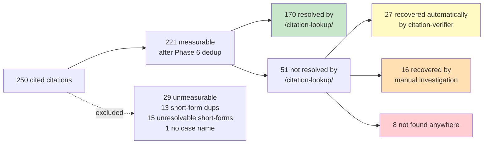

COVERAGE STUDY  ·  FREE LAW PROJECT

# CourtListener coverage of cited cases

### Findings from a 250-citation sample

*Rebecca Fordon, with Claude  ·  May 17, 2026  ·  Drafted for sharing
with the Free Law Project / CourtListener team*

---

## THE FINDINGS, IN BRIEF

We sampled 250 cited citations from 78 recent (2023–2026) opinions in
CourtListener and tried to find each cited case in CL. After excluding
29 unmeasurable rows, **213 of 221 measurable citations (96.4%) are
findable in CL** — though only 170 (76.9%) are resolvable directly by
the `/citation-lookup/` API. The rest required a name+date+court
fallback, manual investigation, or both.

| 170 found via lookup | 27 recovered by citation-verifier | 16 recovered by manual investigation | 8 not found anywhere |
|:---:|:---:|:---:|:---:|
| 76.9% | 12.2% | 7.2% | 3.6% |

For 43 of the 213 found cases (the middle two columns), CL's
`/citation-lookup/` API didn't resolve the cite even though the case
does live in CL. Two patterns account for almost all of them, both
concentrated in federal district and state appellate tiers:

### The patterns behind the 43 lookup misses

| Pattern | Count | Mechanism |
|---|---|---|
| `cl_cluster_citations_empty` | 24 | Opinion cluster in CL, `citations[]` array empty |
| `cl_cluster_parallel_cite_missing` | 5 | Cluster in CL with `citations[]` populated, but only the public-domain slip-op cite — not the parallel print reporter (A.D.3d) the brief used |
| `caption_divergence` (Rule 25(d) / SSA pseudonym) | 5 | Cluster in CL, `citations[]` empty, AND caption diverges from cited form (Rule 25(d), Doe reveal, SSA pseudonym) — defeats name fallback too |
| `cl_docket_only_no_cluster` | 7 | Document in CL via RECAP but no opinion cluster created |
| `cl_cluster_extraction_mismatch` | 1 | Cluster fully in CL with proper `citations[]`; pipeline-side normalization issue prevented discovery |
| `verifier_audit_date_bug` | 1 | Verifier found the right RECAP entry; audit threshold issue blocked it |

The bulk of the gap — 24 of 43 lookup misses — are from **Westlaw
cites to opinions by federal district courts**. The next-largest
clusters are 6 California state appellate reporters (`Cal.5th` /
`Cal.App.5th`, 2022–2025) and the 5 NY Appellate Division opinions
(A.D.3d, 2024–2025) where CL has only the slip-op cite indexed.

§   §   §

## How the 250 citations flowed through the pipeline

The full story is a sequence: first `/citation-lookup/`, then
[citation-verifier](https://github.com/rfordon/citation-verifier)'s
name+date+court fallback against opinion search and RECAP search,
then audit, then manual investigation of borderline cases. The
diagram below shows where each of the 250 citations landed and which
signal got it there.

*Figure 1.  Pipeline flow: 250 citations through phases 4, 4c, 5, 6,
and manual investigation.  Green = direct lookup hit. Yellow =
recovered by citation-verifier. Orange = recovered by manual
investigation. Red = not found anywhere.*

Reading the diagram: the 170 green box is the happy path — direct
citation-lookup hits. The 27 yellow box is what citation-verifier's
fallback recovered automatically. The 16 orange box required manual
investigation (caption divergence, pseudonyms, parallel-cite gaps).
The 8 red box is what couldn't be found by any method.

§   §   §

## Headline coverage

*Figure 2.  Two coverage rates by court tier.  Dark bars: resolvable
directly by `/citation-lookup/`. Light bars: findable in CL by any
method (lookup + verifier + manual).*

| Tier | Found via lookup | Total in CL | Denominator | Lookup rate | Total coverage |
|---|---|---|---|---|---|
| SCOTUS | 45 | 45 | 45 | 100.0% | 100.0% |
| Circuit | 43 | 45 | 46 | 93.5% | 97.8% |
| State_COLR | 38 | 42 | 44 | 86.4% | 95.5% |
| State_IAC | 26 | 36 | 38 | 68.4% | 94.7% |
| Federal_District | 18 | 45 | 48 | 37.5% | 93.8% |
| **OVERALL** | **170** | **213** | **221** | **76.9%** | **96.4%** |

The two rates diverge most for Federal_District (**37.5% via lookup
vs. 93.8% total — a 56-point gap**), driven almost entirely by WL
cites whose clusters exist in CL but have empty `citations[]`.
**State_IAC** also shows a wide gap (68.4% vs. 94.7%, 26-point
spread), driven by the NY A.D.3d parallel-cite issue and California
recent appellate. SCOTUS shows no gap at all.

*Figure 3.  Where the 221 measurable citations end up.  Distribution
across the four buckets above.*

The 8 not-found rows split as: 6 `not_in_cl` (no plausible match in
either opinion search or RECAP — for some, manual investigation could
not find them either), 5 of these were `rescue_was_false_positive`
(citation-verifier's fallback found a wrong cluster; audit correctly
rejected; right cluster also unfindable manually).

§   §   §

## The 43 lookup misses, in detail

### Issue 1 — `cl_cluster_citations_empty` (24 cases)

Pattern: the opinion cluster exists in CL with the case the brief
cites, but its `citations[]` array is empty. Without a populated cite
index, the `/citation-lookup/` API has no way to resolve the cite back
to the cluster, even though everything else about the cluster is
correct. citation-verifier's name+court+date fallback against opinion
search recovers it — *most of the time*.

*Figure 4.  The 24 cluster-empty cases, by reporter type and tier.
Westlaw cites in federal district courts dominate.*

Sub-patterns within the 24:

- **Reporter type:** 17 Westlaw, 6 California state (`Cal.5th`,
  `Cal.App.5th`), 2 `F. Supp. 3d`, 2 `S.W.3d` (Tex. Sup. Ct.),
  1 `F.4th`, 1 `So. 3d`.
- **Year:** 21 of 24 cases were filed 2021 or later. Consistent with
  citation-index ingestion lag for recent opinions.
- **Tier:** 14 Federal_District, 5 State_IAC, 4 State_COLR, 1 Circuit,
  0 SCOTUS.

For 22 of the 24, the cluster's case name matched the cited form
closely enough that citation-verifier's name-based fallback (opinion
search by case name + court + date) landed on the right cluster on
the first try. The audit step then confirmed via party-name match and
date proximity. For 2 of the 24 (the Texas Supreme Court S.W.3d cases),
CL's stored caption is so long (~12 plaintiffs listed before the "v.")
that name search alone didn't surface the right cluster — manual
investigation by case name found them.

### Issue 2 — `cl_cluster_parallel_cite_missing` (5 cases)

Pattern: cluster exists in CL with `citations[]` populated, but only
with the public-domain slip-opinion cite — not the parallel print
reporter cite the brief uses. All 5 are recent NY Appellate Division
opinions cited in `A.D.3d` form; CL has them only as `NY Slip Op`:

| Cited | CL caption | CL citations[] | URL |
|---|---|---|---|
| Gold v. Wallace, 230 A.D.3d 1113 | Gold v. Wallace | `["2024 NY Slip Op 04376"]` | [opinion/10114438](https://www.courtlistener.com/opinion/10114438/) |
| Hersko v. Hersko, 224 A.D.3d 810 | Hersko v. Hersko | `["2024 NY Slip Op 00894"]` | [opinion/9477252](https://www.courtlistener.com/opinion/9477252/) |
| People v. Dondorfer, 235 A.D.3d 71 | People v. Dondorfer | `["2024 NY Slip Op 06432"]` | [opinion/10298541](https://www.courtlistener.com/opinion/10298541/) |
| People v. Kumar, 242 A.D.3d 1231 | People v. Kumar | `["2025 NY Slip Op 05977"]` | [opinion/10717850](https://www.courtlistener.com/opinion/10717850/) |
| People v. Walker, 228 A.D.3d 1318 | People v. Walker | `["2024 NY Slip Op 03278"]` | [opinion/9880367](https://www.courtlistener.com/opinion/9880367/) |

These would not be addressed by populating citations[] from nothing;
they need the *parallel* print-reporter cite to be added alongside the
existing slip-op cite. The scanning project should pick these up.

### Issue 3 — `caption_divergence` (5 cases: 3 Rule 25(d) / Doe + 2 SSA pseudonym)

For these 5, the cluster's case name has diverged from the cited form
in ways that defeat a name-based search.

**Rule 25(d) substitution / Doe reveal (3 cases)** — an official has
been substituted under Federal Rule 25(d), or a Doe defendant has been
replaced with the real name, *after* CL ingested the opinion. The
brief cites the historical caption; CL stores the current one.

| Cited | CL caption | URL |
|---|---|---|
| Gilliard v. McWilliams, 2019 WL 3304707 | Gilliard v. Gruenberg | [opinion/4642011](https://www.courtlistener.com/opinion/4642011/) |
| Preston v. Smith, 2023 WL 5337430 | Preston v. Unidentified | [opinion/9729396](https://www.courtlistener.com/opinion/9729396/) |
| Viken Detection Corp. v. Doe, 2019 WL 5268725 | Viken Detection Corp. v. Bradshaw | [opinion/9731515](https://www.courtlistener.com/opinion/9731515/) |

**SSA pseudonym (2 cases)** — in Social Security appeals, the brief
uses an SSA pseudonym (`Michael B.`, `John S.`); CL indexes the case
under the plaintiff's real surname.

| Cited | CL caption | URL |
|---|---|---|
| Michael B. v. Berryhill, 2019 WL 2269962 | Buschman v. Berryhill | [opinion/9674181](https://www.courtlistener.com/opinion/9674181/) |
| John S. v. Bisignano, 2025 WL 1505405 | Sims v. Bisignano | [opinion/10593230](https://www.courtlistener.com/opinion/10593230/) |

All five clusters also have empty `citations[]`. Once `citations[]` is
populated, the underlying issue evaporates — `/citation-lookup/` would
resolve them without needing to reason about the caption at all.

### Issue 4 — `cl_docket_only_no_cluster` (7 cases)

Pattern: the cited case appears in CL's RECAP archive as a docket and
typically as a downloadable document, but no opinion cluster has been
created from it. The `/citation-lookup/` API is cluster-scoped, so it
can't reach docket-only cases at all.

| Sub-pattern | Count | What it means |
|---|---|---|
| `recap_doc_opinion_not_ingested` | 3 | PDF on CL, `is_free_on_pacer=true`, OCR'd text, opinion-typed description — but no cluster created |
| `recap_doc_unavailable` | 2 | PACER has it, but no one has RECAP'd it; CL has no PDF to work from |
| `recap_doc_not_opinion_typed` | 2 | PDF on CL with text, but description uses non-canonical opinion language ("ORDER RE:" / "ORDER CERTIFYING") |

The three "opinion not ingested" cases are striking because the docs
are on CL with everything needed to make a cluster:

| Case | Docket | Date created on CL | Entry description |
|---|---|---|---|
| Mehar Holdings v. Evanston Ins. Co., 2016 WL 5957681 (W.D. Tex.) | [5474769](https://www.courtlistener.com/docket/5474769/mehar-holdings-llc-v-evanston-insurance-company/) | 2017-04-23 | "ORDER GRANTING 14 Motion for Reconsideration … GRANTS 4 Motion to Remand. Signed by Judge Ezra" |
| Darensburg v. Metro. Transp. Comm'n, 2009 WL 2392094 (N.D. Cal.) | [4182878](https://www.courtlistener.com/docket/4182878/452/darensburg-v-metropolitan-transportation-commission/) | 2017-02-17 | "OPINION ON DEFENDANT'S MOTION FOR ATTORNEYS' FEES. Signed by Mag. J. Laporte on July 7, 2009" |
| Doe v. Lawrence Gen. Hosp., 2025 WL 2808055 (D. Mass.) | [69539673](https://www.courtlistener.com/docket/69539673/doe-v-lawrence-general-hospital/) | 2025-10-02 | "Memorandum & Order" |

Two of the three were created on CL in 2017, but their underlying
opinions were filed in 2009 and 2016 — long enough ago that the
contemporaneous `scrape_pacer_free_opinions` run for those date ranges
may have already completed when the doc was eventually uploaded via
RECAP. The third was created on CL 2025-10-02; whether the live
scraper for `mad` has caught up to October 2025 is unknown from our
data, but the `cand` and `nyed` lag documented in
[CL #7316](https://github.com/freelawproject/courtlistener/issues/7316)
(2–3 months) suggests `mad` may show a similar pattern.

The two `recap_doc_not_opinion_typed` cases (*Cabot v. Lewis*: "ORDER
CERTIFYING INTERLOCUTORY APPEAL"; *Hunter v. CCSF*: "ORDER RE:
PLAINTIFFS MOTION FOR REVIEW OF CLERKS TAXATION OF COSTS") are
substantive 4–8 page Magistrate Judge orders that received WL numbers —
arguably opinion-worthy, but the description text uses non-canonical
language that PACER's `WrtOpRpt.pl` may not flag.

### Issue 5 — Pipeline-side issues (2 cases, no CL change needed)

Two of the 43 recovered cases are not CL gaps at all — they're issues
on our pipeline's side that prevented automatic discovery of cases that
are fully present in CL.

**`cl_cluster_extraction_mismatch` (1 case)** — *Frankling Inc. v. BA
CE Services, Inc., 50 F.4th 432.* CL has the cluster
([8244887](https://www.courtlistener.com/opinion/8244887/franlink-v-bace-services/))
with `citations[]=["50 F.4th 432"]` populated. Two pipeline-side
issues blocked discovery: the LLM extracted the cite as `"50 F 4th
432"` (with space, no periods) which didn't normalize to `"50 F.4th
432"` for citation_lookup, and the brief's case name "Frankling Inc.
v. BA CE Services" differs from CL's "Franlink v. BACE Services" in
both spelling and spacing, defeating name-based fallback. Fix is on
the extraction/normalization side; no CL action needed.

**`verifier_audit_date_bug` (1 case)** — *In re Local TV Advertising
Antitrust Litig., 2023 WL 1863046.* Citation-verifier's Stage B (RECAP
search) found the right docket entry, but the audit forced AMBIGUOUS
because it compared the docket-level `date_filed` (2018, when the MDL
was filed) to the cited year (2023) and found a 5-year gap. The
*opinion entry's* `date_filed` (2023-08-30) is exactly on the cited
year — the audit just checked the wrong date field for long-running
MDL dockets. Fix is in `16_audit_rescues.py`; no CL action needed.

### Citation-type breakdown

*Figure 5.  Reporter type within the 43 lookup misses, split by court
tier.  Westlaw cites account for 56% of the misses; all are federal
district. NY A.D.3d and Tex S.W.3d are the next clusters.*

| Cite type | Federal_District | Circuit | State_COLR | State_IAC | Total |
|---|---|---|---|---|---|
| Westlaw (`YYYY WL N`) | 24 | 0 | 0 | 0 | **24** |
| NY A.D.3d (parallel-cite gap) | 0 | 0 | 0 | 5 | **5** |
| California reporters | 0 | 0 | 1 | 5 | **6** |
| Tex S.W.3d | 0 | 0 | 2 | 0 | **2** |
| `F. Supp.` | 2 | 0 | 0 | 0 | 2 |
| `F.4th` | 0 | 2 | 0 | 0 | 2 |
| `So.` reporters | 0 | 0 | 1 | 0 | 1 |

Westlaw cites account for 56% of the lookup misses. All are federal
district — most district court opinions don't appear in print
reporters, so the WL cite is often the only citable form, and
citation_lookup's resolution to a cluster depends on someone having
put the WL cite in `citations[]`.

§   §   §

## Potential mitigation

1. **The scanning project addresses the print-reporter cluster-empty
   cases (17 of 43).** Six California state appellate, 2 Texas Supreme
   Court (S.W.3d), 2 F. Supp. 3d, 1 F.4th, 1 So.3d that already have
   clusters in CL with empty `citations[]`, plus the 5 NY A.D.3d cases
   whose clusters have only the slip-op cite indexed (needing the
   parallel A.D.3d cite added) — scanning the print reporters will
   populate or add these. This would also resolve the 5 caption-
   divergent sub-cases automatically, since `/citation-lookup/` would
   hit the cluster directly without needing to reason about the
   caption.

2. **Back-fill opinion clusters from free RECAP documents that
   bypassed the live `scrape_pacer_free_opinions` window.** A periodic
   sweep of `recap_documents` with `is_free_on_pacer=true`,
   `is_available=true`, opinion-typed entry descriptions, and no
   associated cluster would catch both old docs uploaded after the
   live scrape window had completed for their date range, and new
   docs where the live scraper for the relevant court is lagging.

3. **Fix the per-court scraper stall/lag pattern surfaced in
   [#7316](https://github.com/freelawproject/courtlistener/issues/7316).**
   Three of the seven `in_recap` cases were docs created on CL in
   2017 but underlying opinions filed years earlier — these wouldn't
   be caught by a live-scraper fix alone. Recommendation 2 above and
   the #7316 fix together would catch both the historical and the
   ongoing gap.

4. **Mine RECAP for WL ↔ cluster mappings.** The scanning project
   only addresses print reporters; it won't touch the 17 WL cases
   that are the single largest miss bucket. CL's RECAP archive,
   however, has millions of briefs/motions that cite cases by *both*
   their WL number *and* their case name (and often docket/year/
   court). A one-time batch pass — essentially running citation-
   verifier's Phase 4c logic over a large brief corpus — would seed
   `citations[]` for thousands of clusters that currently have empty
   arrays. It's bootstrapping from data CL already owns. Could be
   more impactful than (1) for the WL category specifically, because
   it permanently populates `citations[]` rather than relying on
   query-time resolution.

5. **Push a neutral citation system.** A long-term play: adopt and
   advocate for a Free Law–style neutral citation format (year, court,
   sequence number) that doesn't depend on either Westlaw or print
   reporters. Even partial adoption by federal districts would reduce
   the WL dependency that drives most of the misses in this sample.

6. **"Did you mean?" on `/citation-lookup/` 404s.** Instead of just
   returning 404, the endpoint could return `{status: 404, suggestions:
   [clusters with matching name+year+court]}`. Lets API consumers
   (like citation-verifier or LLM agents calling CL) know "there's
   nothing here under this cite, but here are likely candidates."
   Cheap server-side change; clients still decide what to do.

7. **Federated cite registry with other free-law projects.**
   vLex / Fastcase / CourtListener could share a common cite ↔
   permalink registry. Likely a longer arc but addresses the same
   underlying issue from a different angle.

§   §   §

## Methodology

**Corpus.** 78 citing opinions, predominantly 2023–2026, mined from CL
across a mix of federal (60) and state (18) courts via the benchmark's
`mine_citing_opinions` step.

**Extraction.** Per-opinion JSON via the Anthropic Haiku model
(`extract_citations.py`). LLM extraction rather than eyecite for three
reasons that surfaced in an earlier v1 pass: (a) eyecite's
paren-attribution bug propagates wrong years when a citation has
multiple parallel reporters; (b) smart quotes and apostrophes in case
names sometimes truncate the extracted name; and (c) slip-opinion
placeholders like `-- F. Supp. 3d ----` get absorbed into the
defendant field, poisoning `case_name` for downstream search. The LLM
extraction also captures fields eyecite doesn't surface directly —
`court_hint` (separated cleanly from editorial parentheticals),
`month`/`day`, and `docket_number` — which are needed for the
WL/LEXIS docket-search fallback that recovers caption-divergent cases
(Rule 25(d) substitutions, SSA pseudonyms). Tradeoffs: temp=1.0 (the
`claude -p` default; no flag exposed), higher cost per opinion than
eyecite, and LLM hallucination risk — mitigated by validating each
`citation_string` as a verbatim substring of the source opinion before
downstream use. Incomplete or extraction-artifact citations (~13.5%
of raw LLM output) are excluded by using `citations_valid` only.

**Pre-filter & dedup.** Drop short-form citations (`Id.`, bare pin
cites) and foreign reporters (`Eng. Rep.`, `Q.B.`, etc.); dedup on
`(citing_cluster, citation_string, parenthetical)`; K=5 cap per
`(citing_cluster, cited_tier)` for opinion-level diversity.

**Stratified sample.** 50 cited citations per tier across SCOTUS,
Circuit, State_COLR, State_IAC, and Federal_District (250 total).

### Verification pipeline

- **Phase 4** — `/api/rest/v4/citation-lookup/` (strict)
- **Phase 4c** — citation-verifier fallback: name-based search against
  the opinion-search and RECAP-search APIs, with court-id + date
  filters and multi-factor scoring on name, court, date, and docket
  number (`15_staged_fallback_rigorous.py`)
- **Phase 5** — per-rescue audit: cite-in-cluster cross-check,
  party-name presence on both sides, court_id match, ±2-year date
  proximity (`16_audit_rescues.py`)
- **Phase 6** — short-form citation dedup
  (`17_build_unified_review.py`): rows whose fuller sibling exists in
  the same citing opinion are dropped from both numerator and
  denominator; unresolvable short-forms (no antecedent) are dropped
  from the denominator only.

**Manual investigation.** Two passes by hand: an eyeball review of
`rescue_was_false_positive` audit verdicts identified 7 false negatives
across three discoverability categories (Rule 25(d), SSA pseudonym,
docket-only edge cases); and a separate review of the remaining
`not_found_anywhere` rows surfaced 9 additional cases that are in CL
but were missed by both `/citation-lookup/` and citation-verifier's
automated fallback. Both passes are recorded in
`manual_corrections.csv`. A separate `18_diagnose_recap_cases.py` pass
fetches the `recap_document` for each `in_recap` row and sub-classifies
why no opinion cluster was ingested.

The pipeline is reproducible end-to-end from the scripts in
`benchmark/scratch/cl-coverage-offshoot/` against an unchanged
CourtListener corpus.

§   §   §

## Caveats and limitations

- **Sample size.** 250 rows across five tiers; per-tier sample sizes
  range 38–48 after Phase 6 exclusions. Confidence intervals on the
  individual tier coverage numbers are wide. The overall 96.4% should
  be read as a point estimate with ~±2 pp of slop.

- **NYSD skip.** We initially targeted SDNY (`nysd`) as one of our
  federal district sources for citation mining. We had to drop it
  because the live scraper isn't currently capturing nysd free
  opinions — see
  [CL #7316](https://github.com/freelawproject/courtlistener/issues/7316).
  This biases the sample by under-representing SDNY citations. SDNY
  is a heavy producer of recent unpublished WL opinions, which is the
  exact citation pattern most affected by `cl_cluster_citations_empty`.
  The 93.8% federal-district coverage number is therefore likely an
  overestimate of what a corpus that included SDNY citations would
  show.

- **Manual investigation matters a lot.** Without the 16 manual
  corrections, measured coverage would be 197/221 = 89.1%. Manual
  investigation lifted that to 213/221 = 96.4% — a 7.3 point gain.
  Anyone re-running this measurement at scale without comparable manual
  follow-up should expect the lookup-only and verifier-only rates
  (76.9% and 89.1% respectively) rather than the 96.4% total.

- **Pipeline-side findings.** Two of the 43 lookup misses (Frankling
  extraction mismatch and the In re Local TV audit date bug) are
  issues on our pipeline's side, not in CL. They're documented as
  CL-side issues only in the sense that they show up in our
  coverage measurement; the fixes are in citation-verifier and the
  audit logic.

- **Regional reporter tier ambiguity.** `A.3d`, `P.3d`, `N.E.3d`,
  etc., carry both COLR and IAC opinions. Initial tier classification
  used the LLM-extracted `court_hint` from the Bluebook parenthetical
  when available; otherwise reporter pattern. Mis-classifications
  within state appellate are possible.

- **Phase 6 exclusions.** 29 of 250 rows are excluded from the
  denominator: 13 short-form duplicates of a fuller sibling in the
  same citing opinion (out of both numerator and denominator), 15
  unresolvable short-forms with no antecedent in the same opinion
  (out of denominator only — they're not measurable misses), and 1
  LLM extraction artifact where the case name was dropped.

- **Audit false positives.** A separate pre-existing
  `parties_present`-only verdict rule produced 4 audit false positives
  (Wilson, Wilmington Trust, Rose Way, Thurman) before we added the
  cite-in-cluster cross-check rule. In each, citation-verifier picked
  a different cluster whose own `citations[]` array contained cites
  different from the one cited in the brief — definitive evidence of
  a wrong match. These are now correctly marked
  `rescue_was_false_positive` and counted in `not_found_anywhere`.

- **Invalid citations excluded upfront.** ~13.5% of the LLM's raw
  extracted citations were invalid (short cites or extraction
  artifacts) and are excluded from this sample by using
  `citations_valid` only.

## Reproducibility

All code and data live under
`benchmark/scratch/cl-coverage-offshoot/`. Key artifacts:

| File | What it is |
|---|---|
| `final_200.csv` | Stratified 250-row sample (post-dedup, post-cap) |
| `coverage_per_citation.csv` | Phase 4 (`/citation-lookup/`) results |
| `staged_fallback_rigorous_per_row.csv` | Phase 4c (name+RECAP fallback) results |
| `audit_per_row.csv` | Phase 5 audit verdicts on each rescue |
| `recap_diagnosis.csv` | Phase 18 sub-classification of the 7 `in_recap` cases |
| `manual_corrections.csv` | 16 user-investigated rescues (7 original + 9 from the not-found re-review) |
| `unified_review.csv` | Full audit trail (37 columns × 250 rows) |
| `unified_review_concise.csv` | Reviewer-facing view (9 columns × 250 rows) |

To regenerate from the raw extractions:
`12_stratify.py` → `13_lookup_coverage.py` → `15_staged_fallback_rigorous.py`
→ `16_audit_rescues.py` → `18_diagnose_recap_cases.py`
→ `17_build_unified_review.py`.
